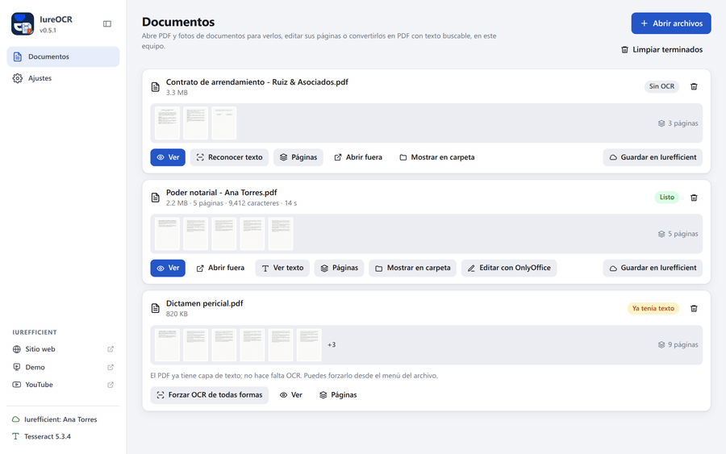
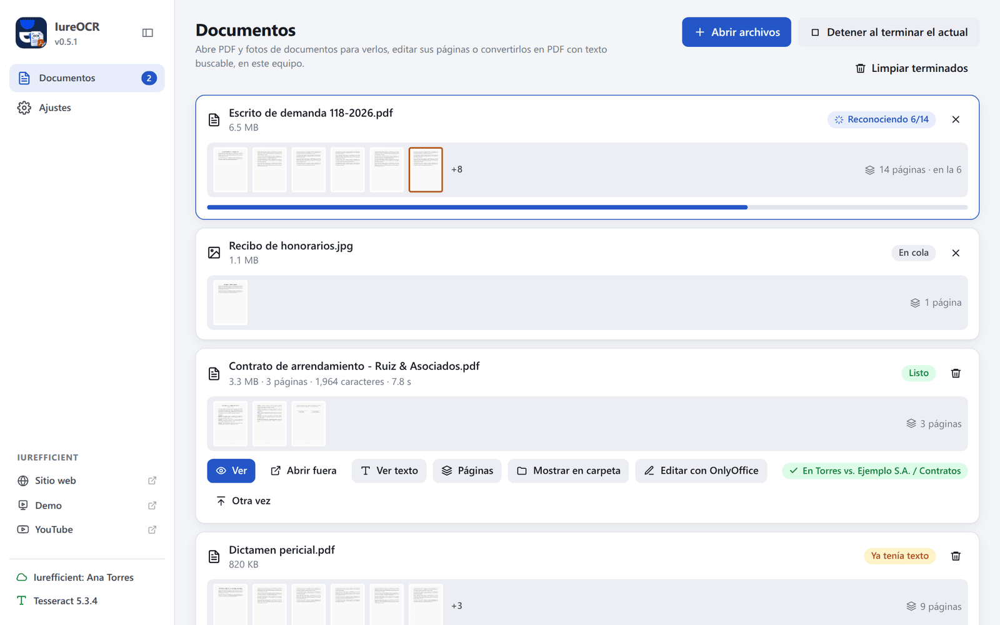
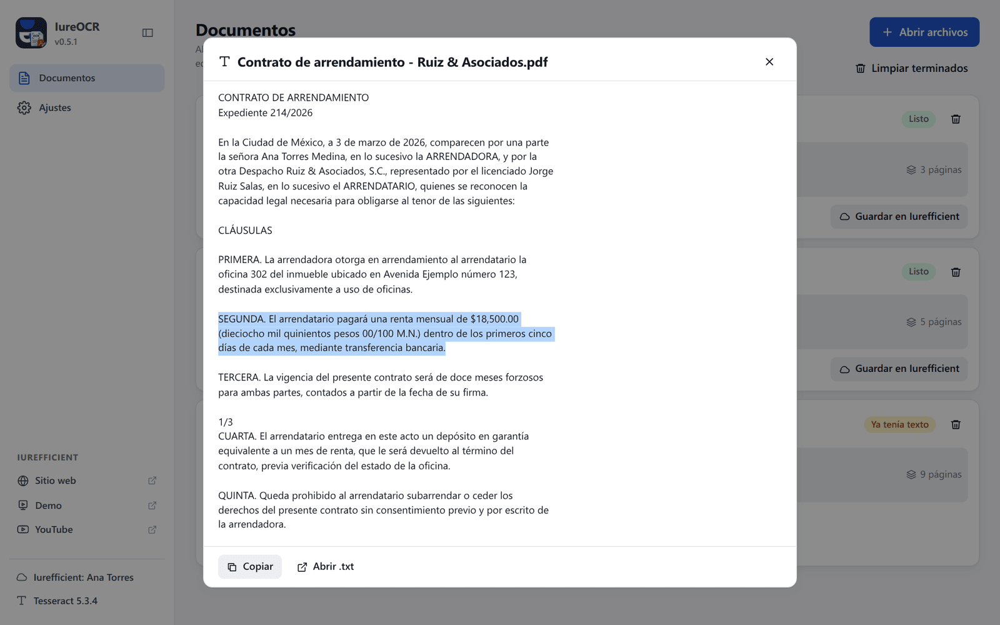
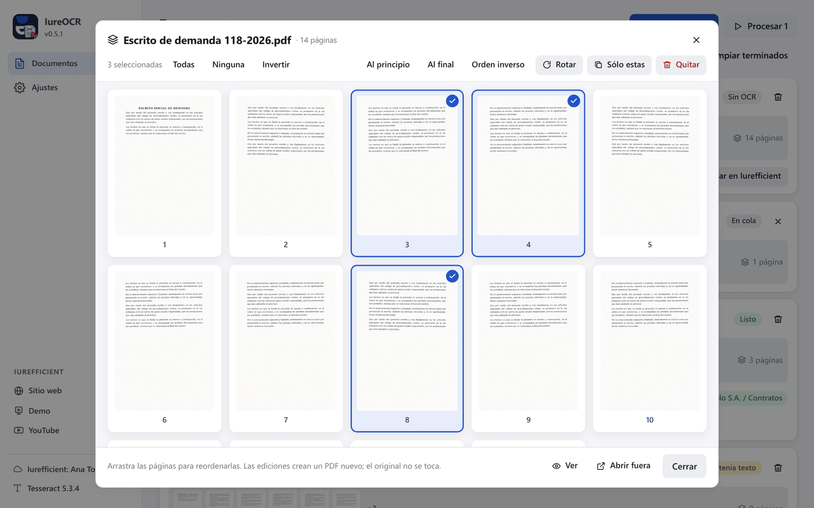
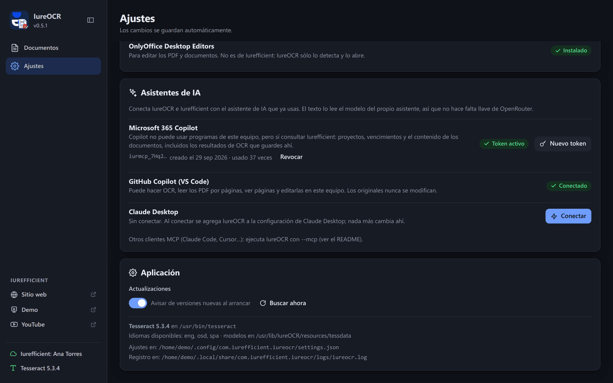

[Read in English](README.md)

<p align="center">
  
</p>
<h1 align="center">IureOCR</h1>
<p align="center">Convierte escaneos y fotos de documentos en PDF con texto buscable, en tu propio equipo.</p>
<p align="center">
  <a href="https://github.com/ellaguno/iureocr/releases/latest"></a>
  <a href="https://github.com/ellaguno/iureocr/releases"></a>
  <a href="LICENSE"></a>
  
</p>
<p align="center">
  <a href="https://github.com/ellaguno/iureocr/releases/latest"><b>Descargar para Linux · Windows · macOS</b></a>
</p>

<p align="center">
  
</p>

IureOCR reconoce el texto de PDF escaneados y fotos de documentos con
[Tesseract](https://github.com/tesseract-ocr/tesseract) y deja un PDF con texto buscable,
listo para subir a [Iurefficient](https://iurefficient.com). Es una de las
[apps de escritorio de Iurefficient](#parte-de-la-suite-iurefficient) y comparte con ellas
la cuenta, el llavero y la sesión.

## ¿Por qué IureOCR?

- **Tus documentos no salen de tu equipo.** El OCR corre aquí con Tesseract; no se envía ni
  el documento ni el texto. La cuenta de Iurefficient sólo hace falta para guardar ahí el
  resultado.
- **El PDF se sigue viendo como el original.** El resultado conserva la imagen escaneada y le
  pone encima una capa de texto invisible para buscar y copiar, y además deja un `.txt`.
- **Expedientes completos de una vez.** Una cola con progreso por página, y los PDF que ya
  tienen texto se omiten en lugar de procesarse otra vez.
- **Herramientas de páginas incluidas.** Ver, quitar, conservar, rotar y reordenar páginas
  sin abrir otro programa.
- **Funciona con tu asistente de IA.** `IureOCR --mcp` permite que Claude, GitHub Copilot y
  otros clientes MCP hagan OCR y lean PDF en este equipo, sin llave de OpenRouter.

## Capturas

<table>
  <tr>
    <td width="50%"><br><sub>La cola: un archivo en reconocimiento (página 6 de 14), uno en espera, uno terminado y guardado en Iurefficient y otro que ya tenía texto.</sub></td>
    <td width="50%"><br><sub>El texto reconocido de un documento terminado, listo para seleccionar y copiar.</sub></td>
  </tr>
  <tr>
    <td width="50%"><br><sub>Herramientas de páginas: marca páginas para rotarlas, conservarlas o quitarlas, o arrástralas a otro orden.</sub></td>
    <td width="50%"><br><sub>Ajustes → Asistentes de IA: conecta Microsoft 365 Copilot, GitHub Copilot en VS Code o Claude Desktop.</sub></td>
  </tr>
</table>

## Qué hace

- **OCR local con Tesseract** en español e inglés (más idiomas si tu Tesseract los tiene).
  Nada sale del equipo: ni el documento ni el texto.
- Acepta **PDF escaneados** e **imágenes** (JPG, PNG, TIFF, BMP, WEBP). El resultado es un
  PDF con la imagen original y, encima, una capa de texto invisible: se puede buscar, copiar
  y el servidor de Iurefficient lo indexa sin volver a procesarlo. Además deja un `.txt` con
  el texto plano.
- **Omite los PDF que ya tienen texto** (mismo criterio que el servidor: menos de 100
  caracteres en las tres primeras páginas = hay que reconocer). Se puede forzar.
- **Cola** con progreso por página, cancelación y reintento. Abrir un archivo no lanza el
  OCR: queda como «Sin OCR» para verlo, editar sus páginas o subirlo, y **Reconocer texto**
  (o **Reconocer texto de N** para todos) lo inicia. En Ajustes se puede activar que el
  texto se reconozca en cuanto se abre un archivo.
- **Visor interno**: scroll continuo, ir a página, zoom (botones, `+`/`-`, Ctrl+rueda) y
  teclado (RePág, AvPág, Inicio, Fin, Esc). Sólo se dibujan las páginas visibles, así que
  abre expedientes de cientos de páginas sin esperar. Resalta la página que se está
  reconociendo y, al terminar el OCR, muestra el PDF resultante.
- **Edición de páginas** con miniaturas: quitar páginas, conservar sólo las marcadas,
  rotarlas 90° o reordenarlas arrastrando (también «Al principio», «Al final» y «Orden
  inverso»). Cada edición escribe un PDF nuevo junto al original (« - sin páginas»,
  « - rotado», …); el original no se modifica.
- Agrega archivos arrastrándolos a la ventana, abriéndolos con IureOCR desde el sistema o
  con enlaces `iureocr://ocr?file=…`.
- **Guardar en Iurefficient**: en un proyecto (API REST) o en cualquier carpeta del árbol de
  documentos (WebDAV). Con la unidad de IureDav montada, basta con elegirla como carpeta de
  salida.
- Para editar el resultado sugiere **OnlyOffice Desktop Editors**: lo detecta si está
  instalado y, si no, enlaza su descarga. No se incluye.
- **Interfaz en inglés y español**: inglés por defecto y español si el sistema operativo está
  en español; se puede elegir en Ajustes → Apariencia. Es independiente de los idiomas del
  texto que reconoce Tesseract.

Pendiente para versiones siguientes (ver [CHANGELOG](CHANGELOG.md)): unir PDF, dividir por
rangos, proteger con contraseña, marca de agua y numerar; compresión real de imágenes;
rescate de páginas ilegibles con un modelo de visión; la lista de documentos pendientes de
OCR de la instancia, y Tesseract incluido también en macOS.

## Descarga e instalación

Baja el instalador de la [última versión](https://github.com/ellaguno/iureocr/releases/latest):

| Archivo | Sistema |
| --- | --- |
| `IureOCR_<versión>_1-windows-x64.exe` (o `.msi`) | Windows 10/11, x64. Incluye Tesseract. |
| `IureOCR_<versión>_2-macos-universal.dmg` | macOS 12 o posterior, Intel y Apple Silicon. Requiere `brew install tesseract`. |
| `IureOCR_<versión>_3-linux-x64.deb` / `.rpm` | Debian/Ubuntu o Fedora. Instalan Tesseract con español e inglés como dependencias. |
| `IureOCR_<versión>_3-linux-x64.AppImage` | Cualquier otra distribución de Linux. Instala antes Tesseract de tu distribución. |

Los instaladores no tienen firma de código, así que Windows y macOS avisan la primera vez
que los abres; en [Política de firma de código](#política-de-firma-de-código) se explica qué
significa y cómo continuar.

### Tesseract en cada sistema

| Sistema | De dónde sale Tesseract | Modelos de idioma |
| --- | --- | --- |
| Linux | el paquete del sistema: el `.deb`/`.rpm` dependen de `tesseract-ocr` con `spa` y `eng` | los incluidos en la app (`tessdata_fast`) |
| Windows | **incluido en el instalador** (build de UB Mannheim, Apache-2.0) | incluidos |
| macOS | `brew install tesseract` (por ahora no va incluido) | incluidos |

La app busca Tesseract en este orden: la variable `IUREOCR_TESSERACT`, el que viene dentro
del instalador, las rutas habituales del sistema y el `PATH`. En Ajustes se ve cuál encontró,
su versión y los idiomas disponibles.

## Cómo funciona por dentro

1. **pdfium** rasteriza cada página del PDF a JPEG a la resolución elegida (300 ppp por
   defecto). Las imágenes se pasan tal cual.
2. **Tesseract** recibe la lista de páginas y produce, él mismo, el PDF con la capa de texto
   (su renderizador `pdf`, el mismo que usa ocrmypdf) y el `.txt`.
3. El resultado se guarda junto al original con el sufijo ` - OCR` (configurable) o en una
   carpeta fija.

Un PDF con texto ya legible no se rasteriza: se avisa y se ofrece forzarlo.

## Uso desde Claude, Copilot y otros agentes (MCP)

`IureOCR --mcp` arranca un servidor [MCP](https://modelcontextprotocol.io) por stdio, sin
ventana. Así, Claude Desktop, Claude Code, Copilot en VS Code o cualquier cliente MCP puede
usar el OCR y las herramientas de PDF de este equipo. El OCR corre aquí y el modelo del
cliente lee el texto y hace el resto, así que no hace falta ninguna llave de OpenRouter. Del
equipo sólo sale el texto que el agente decide leer.

| Herramienta | Qué hace |
| --- | --- |
| `ocr_file` | OCR de un PDF escaneado o una imagen; deja el PDF buscable y el `.txt` junto al original y devuelve el texto |
| `extract_text` | Lee la capa de texto de un PDF por rango de páginas (o un `.txt`), para documentos largos |
| `pdf_info` | Páginas, tamaños y si el PDF ya tiene texto |
| `render_page` | Una página como imagen, para que el modelo vea firmas, sellos o tablas |
| `edit_pdf_pages` | Quitar, conservar, girar o reordenar páginas (archivo nuevo) |
| `ocr_languages` | Versión de Tesseract e idiomas instalados |

Nunca se modifica el original y las rutas deben ser absolutas. Toma los idiomas, la
resolución y la carpeta de salida de los Ajustes de la app. El registro va a
`iureocr-mcp.log`, junto al de la app.

`IureOCR --mcp-config` imprime lo que hay que pegar en la configuración del cliente, con la
ruta real del ejecutable:

```json
{ "mcpServers": { "iureocr": { "command": "/ruta/a/IureOCR", "args": ["--mcp"] } } }
```

En IureOCR, **Ajustes → Asistentes de IA** detecta qué asistentes hay en el equipo y conecta
cada uno por el camino que funciona con él:

- **Microsoft 365 Copilot** (el que tiene casi todo el mundo) no puede usar programas del
  equipo, pero sí el servidor MCP de la instancia de Iurefficient. Con la sesión iniciada,
  **Crear acceso para Copilot** genera un token `iurmcp_…` (un año de vigencia) y muestra la
  URL del servidor y los pasos para agregarlo a un agente en Copilot Studio (encabezado
  `X-MCP-Token`). Copilot ve lo mismo que el usuario en Iurefficient; para que lea un
  escaneo, hay que guardar ahí el resultado del OCR. Los tokens se revocan desde la misma
  fila.
- **GitHub Copilot en VS Code**: **Conectar** abre el enlace `vscode:mcp/install?…`; VS Code
  pide confirmación y guarda el servidor en su configuración. IureOCR no la escribe.
- **Claude Desktop**: **Conectar** agrega la entrada a `claude_desktop_config.json` sin tocar
  el resto (deja una copia `.bak-iureocr`) y avisa si la app cambió de lugar. Después hay que
  cerrar y abrir Claude Desktop.

Para otros clientes: `claude mcp add iureocr -- /ruta/a/IureOCR --mcp` en Claude Code, o la
entrada de `--mcp-config` en su configuración.

## Parte de la suite Iurefficient

| App | Qué hace |
| --- | --- |
| [IureTranscribe](https://github.com/ellaguno/iuretranscribe) | Transcripción local con Whisper, grabación en vivo con quién habló, resumen y minuta. |
| [IureEditor](https://github.com/ellaguno/iureditor) | Editor Markdown WYSIWYG con Mermaid, LaTeX y exportación a PDF/DOCX. |
| [IureDav](https://github.com/ellaguno/iuredav) | Monta un servidor WebDAV (o Iurefficient) como unidad. |
| **IureOCR** | OCR local que convierte escaneos en PDF con texto buscable. |
| [iureTI](https://github.com/ellaguno/iureTI) | Sonda de descubrimiento de activos de TI para el inventario de Iurefficient. |

## Contribuir

Los issues y pull requests son bienvenidos. Buenas primeras contribuciones:

- **Reportes de errores con el archivo de registro** adjunto (en
  [Dónde guarda las cosas](#dónde-guarda-las-cosas) está su ubicación), y el sistema y la
  versión que usas.
- **Traducciones**: un idioma nuevo de la interfaz es un diccionario más en
  `src/lib/i18n.svelte.ts`, junto al de inglés y el de español.
- **Documentación**: correcciones y explicaciones más claras en este README.

Para compilar y ejecutar la app, ve [Desarrollo](#desarrollo) más abajo.

## Desarrollo

<details>
<summary>Requisitos, compilación y comprobaciones</summary>

Requisitos: Node 22, Rust estable, las dependencias de Tauri 2 de tu sistema y Tesseract
instalado (en Linux `sudo apt install tesseract-ocr tesseract-ocr-spa tesseract-ocr-eng`).

```bash
npm ci
python3 scripts/descargar-pdfium.py     # biblioteca pdfium de esta plataforma
python3 scripts/descargar-tessdata.py   # modelos spa, eng y osd (tessdata_fast)
npm run tauri dev
```

En Windows, además, `python3 scripts/descargar-tesseract-windows.py` deja el Tesseract que se
empaqueta (requiere `7z`).

```bash
npm run check                 # tipos del frontend
cd src-tauri && cargo check   # backend
npm run tauri build           # instaladores de esta plataforma
```

Las capturas y los GIF de este README se generan con la interfaz real y un backend simulado:
ver [`scripts/readme-media/`](scripts/readme-media/README.md).

</details>

<details>
<summary>Publicar una versión</summary>

Sube la versión en `package.json`, `src-tauri/Cargo.toml` y `src-tauri/tauri.conf.json`,
añade la sección al CHANGELOG y etiqueta:

```bash
git commit -am "v0.2.0: …"
git tag -a v0.2.0 -m "IureOCR 0.2.0" && git push --follow-tags
```

`.github/workflows/build.yml` compila en cada push y, con una etiqueta `vX.Y.Z`, publica la
release con instaladores para Windows (`1-windows-x64`), macOS (`2-macos-universal`) y Linux
(`3-linux-x64`, `.deb`, `.rpm` y AppImage), más el `latest.json` del actualizador. Las
actualizaciones se firman con la clave minisign de la app (`~/.tauri/iureocr-updater.key`).
El workflow también tiene pasos de firma Authenticode con SignPath, que sólo se ejecutan si
existen el secreto y las variables `SIGNPATH_*`; no están configurados, así que los
instaladores de Windows se publican sin firmar.

</details>

<details>
<summary>Actualizaciones</summary>

Al arrancar (se puede desactivar en Ajustes) y con **Buscar ahora**, la app busca una
versión nueva. El actualizador de Tauri la instala desde la propia app y antes verifica su
firma minisign. Cada instalación recibe su tipo de paquete: el `.exe` en Windows, el
`.app.tar.gz` en macOS, el AppImage, o el `.deb`/`.rpm` (instalarlo pide la contraseña de
administrador). Si la actualización no se puede instalar, la app muestra el error y un botón
para abrir la página de descarga.

</details>

### Dónde guarda las cosas

| Qué | Linux | Windows | macOS |
| --- | --- | --- | --- |
| Ajustes | `~/.config/com.iurefficient.iureocr/settings.json` | `%APPDATA%\com.iurefficient.iureocr\settings.json` | `~/Library/Application Support/com.iurefficient.iureocr/settings.json` |
| Registro | `~/.local/share/com.iurefficient.iureocr/logs/iureocr.log` | `%APPDATA%\com.iurefficient.iureocr\logs\iureocr.log` | `~/Library/Application Support/com.iurefficient.iureocr/logs/iureocr.log` |

Las credenciales van al llavero del sistema, compartidas con las otras apps de Iurefficient;
la cuenta activa (instancia y correo) en `<config>/iurefficient/`.

## Política de firma de código

- **Los instaladores de Windows por ahora no tienen firma de código.** La primera vez que
  ejecutes uno, SmartScreen puede mostrar «Windows protegió su PC» con un editor
  desconocido: elige **Más información → Ejecutar de todas formas**.
- **macOS: la app no está notarizada** por Apple. La primera vez, haz clic derecho (o
  Control-clic) sobre IureOCR en Aplicaciones y elige **Abrir**, o ve a **Ajustes del Sistema
  → Privacidad y seguridad** y pulsa **Abrir de todas formas**.
- Todos los instaladores se compilan desde este repositorio con GitHub Actions
  (`.github/workflows/build.yml`) y se publican sólo en la
  [página de releases](https://github.com/ellaguno/iureocr/releases). Descárgalos de ahí.
- Qué sí va firmado: los paquetes de actualización (`.exe`, `.msi`, `.app.tar.gz`, AppImage,
  `.deb` y `.rpm`) llevan firma minisign (archivos `.sig` y `latest.json`), y la app la
  comprueba con la clave pública que trae antes de instalar una actualización.
- **Mantenedor** (commits y revisiones): Eduardo Llaguno ([@ellaguno](https://github.com/ellaguno)).

### Política de privacidad

Este programa no transfiere información a otros sistemas en red salvo que lo pida
expresamente el usuario o la persona que lo instala u opera.

El reconocimiento de texto corre por completo en el equipo del usuario con
[Tesseract](https://github.com/tesseract-ocr/tesseract); los documentos nunca salen de la
máquina. En concreto, IureOCR sólo se conecta a:

- la instancia de Iurefficient que configura el usuario, y sólo cuando hay una cuenta
  configurada: para comprobar la sesión (al arrancar y en Ajustes), y cuando el usuario
  inicia sesión, guarda ahí un documento o administra los tokens de acceso para Copilot. Sin
  cuenta no se contacta nunca;
- GitHub (`api.github.com` y los archivos de las releases en `github.com`): al arrancar,
  para ver si hay una versión nueva (se puede desactivar en Ajustes), y al abrir Ajustes,
  para mostrar la última versión de las otras apps de Iurefficient.

No recopila telemetría ni estadísticas de uso. Las credenciales se guardan en el llavero del
sistema operativo, nunca en archivos de configuración.

## Licencia

Apache License 2.0 (ver [LICENSE](LICENSE)). Tesseract (Apache-2.0), pdfium (BSD-3) y los
modelos `tessdata_fast` (Apache-2.0) conservan sus licencias.
