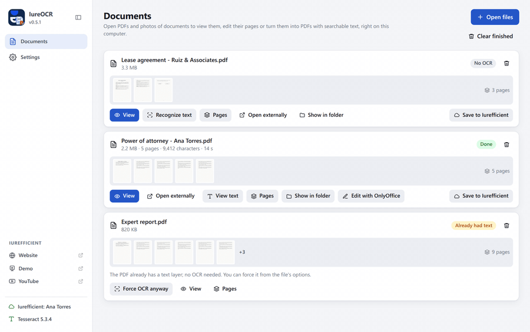
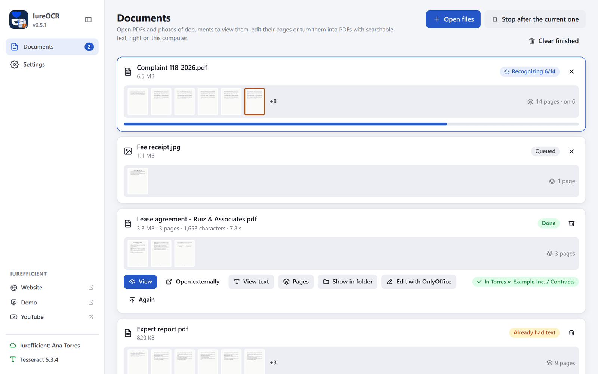
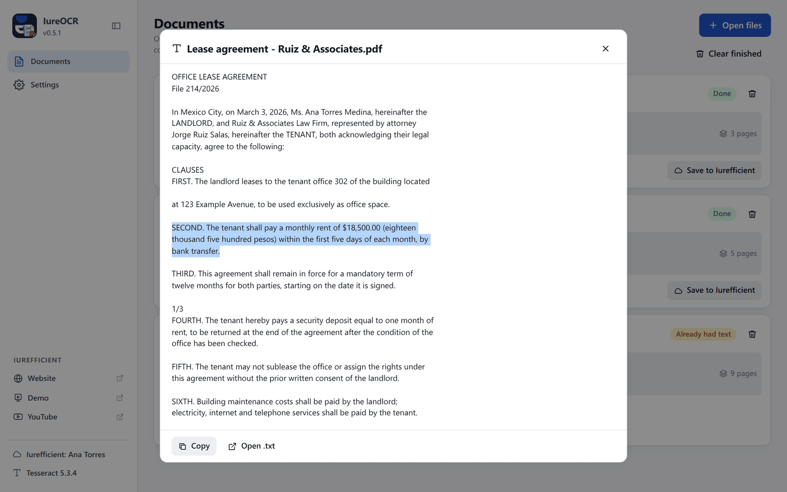
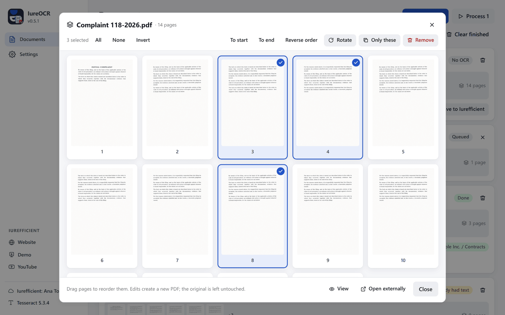
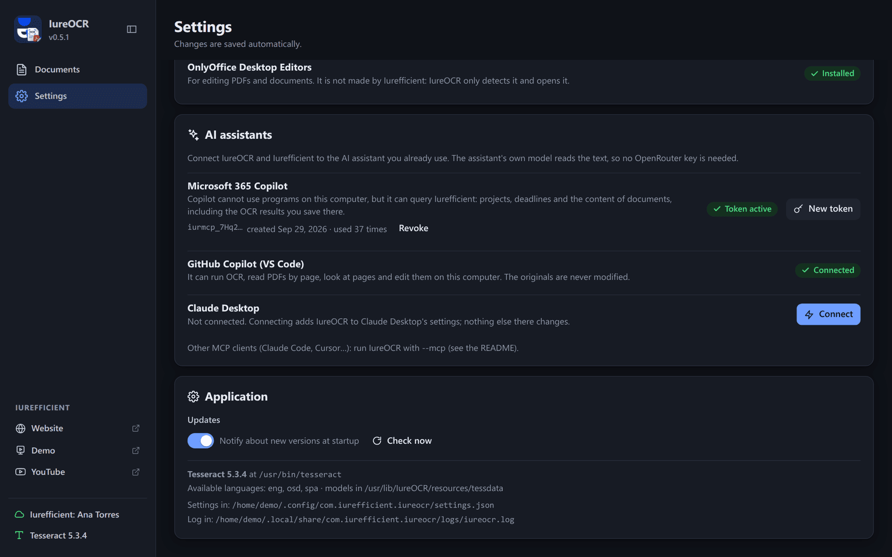

[Leer en español](README.es.md)

<p align="center">
  
</p>
<h1 align="center">IureOCR</h1>
<p align="center">Turn scans and photos of documents into searchable PDFs, on your own computer.</p>
<p align="center">
  <a href="https://github.com/ellaguno/iureocr/releases/latest"></a>
  <a href="https://github.com/ellaguno/iureocr/releases"></a>
  <a href="LICENSE"></a>
  
</p>
<p align="center">
  <a href="https://github.com/ellaguno/iureocr/releases/latest"><b>Download for Linux · Windows · macOS</b></a>
</p>

<p align="center">
  
</p>

IureOCR recognizes the text in scanned PDFs and photos of documents with
[Tesseract](https://github.com/tesseract-ocr/tesseract) and produces a PDF with
searchable text, ready to upload to [Iurefficient](https://iurefficient.com). It is one of
the [Iurefficient desktop apps](#part-of-the-iurefficient-suite) and shares the account,
keychain and session with them.

## Why IureOCR

- **Your documents stay on your computer.** OCR runs locally with Tesseract; neither the
  document nor the text is sent anywhere. An Iurefficient account is only needed to save
  the result there.
- **The PDF still looks like the original.** The result keeps the scanned image and adds an
  invisible text layer on top, so you can search and copy, plus a `.txt` with the plain text.
- **Whole case files in one go.** A queue with per-page progress, and PDFs that already have
  text are skipped instead of being processed again.
- **Page tools included.** View, remove, keep, rotate and reorder pages without opening
  another program.
- **Works with your AI assistant.** `IureOCR --mcp` lets Claude, GitHub Copilot and other MCP
  clients run OCR and read PDFs on this computer, with no OpenRouter key.

## Screenshots

<table>
  <tr>
    <td width="50%"><br><sub>The queue: one file being recognized (page 6 of 14), one queued, one done and saved to Iurefficient, one that already had text.</sub></td>
    <td width="50%"><br><sub>The recognized text of a finished document, ready to select and copy.</sub></td>
  </tr>
  <tr>
    <td width="50%"><br><sub>Page tools: mark pages to rotate, keep or remove them, or drag them into a new order.</sub></td>
    <td width="50%"><br><sub>Settings → AI assistants: connect Microsoft 365 Copilot, GitHub Copilot in VS Code or Claude Desktop.</sub></td>
  </tr>
</table>

## Features

- **Local OCR with Tesseract** in Spanish and English (more languages if your Tesseract has
  them). Nothing leaves the computer: neither the document nor the text.
- Accepts **scanned PDFs** and **images** (JPG, PNG, TIFF, BMP, WEBP). The result is a PDF
  with the original image and an invisible text layer on top: it can be searched and copied,
  and the Iurefficient server indexes it without processing it again. It also leaves a
  `.txt` with the plain text.
- **Skips PDFs that already have text** (same rule as the server: fewer than 100 characters
  in the first three pages = needs recognition). It can be forced.
- **Queue** with per-page progress, cancel and retry. Opening a file does not start OCR by
  itself: it stays as "No OCR" so you can view it, edit its pages or upload it, and
  **Recognize text** (or **Recognize text in N** for all of them) starts it. Settings has an
  option to recognize files as soon as they are opened.
- **Built-in viewer**: continuous scroll, go to page, zoom (buttons, `+`/`-`, Ctrl+wheel) and
  keyboard (PgUp, PgDn, Home, End, Esc). Only the visible pages are drawn, so files with
  hundreds of pages open without waiting. It highlights the page being recognized and shows
  the resulting PDF when OCR finishes.
- **Page editing** with thumbnails: remove pages, keep only the selected ones, rotate them
  90°, or reorder them by dragging (also "To start", "To end" and "Reverse order"). Each edit
  writes a new PDF next to the original (` - pages removed`, ` - rotated`, …); the original
  is not modified.
- Add files by dragging them onto the window, opening them with IureOCR from the system or
  with `iureocr://ocr?file=…` links.
- **Save to Iurefficient**: to a project (REST API) or to any folder in the document tree
  (WebDAV). With the IureDav drive mounted, just choose it as the output folder.
- For editing the result it suggests **OnlyOffice Desktop Editors**: it detects it if
  installed and otherwise links to its download. It is not bundled.
- **English and Spanish interface**: English by default, and Spanish if the operating system
  is set to Spanish; it can be changed in Settings → Appearance. This is independent of the
  text languages Tesseract recognizes.

Planned for upcoming versions (see the [CHANGELOG](CHANGELOG.md)): merging PDFs, splitting
by ranges, password protection, watermark and page numbers; real image compression; rescuing
unreadable pages with a vision model; the instance's list of documents pending OCR; and
Tesseract bundled on macOS too.

## Download and install

Get the installer from the [latest release](https://github.com/ellaguno/iureocr/releases/latest):

| File | System |
| --- | --- |
| `IureOCR_<version>_1-windows-x64.exe` (or `.msi`) | Windows 10/11, x64. Tesseract is included. |
| `IureOCR_<version>_2-macos-universal.dmg` | macOS 12 or later, Intel and Apple Silicon. Needs `brew install tesseract`. |
| `IureOCR_<version>_3-linux-x64.deb` / `.rpm` | Debian/Ubuntu or Fedora. They install Tesseract with Spanish and English as dependencies. |
| `IureOCR_<version>_3-linux-x64.AppImage` | Any other Linux distribution. Install Tesseract from your distribution first. |

The installers are not code-signed, so Windows and macOS warn the first time you open them;
see [Code signing policy](#code-signing-policy) for what that means and how to continue.

### Tesseract on each system

| System | Where Tesseract comes from | Language models |
| --- | --- | --- |
| Linux | the system package: the `.deb`/`.rpm` depend on `tesseract-ocr` with `spa` and `eng` | the ones bundled with the app (`tessdata_fast`) |
| Windows | **bundled in the installer** (UB Mannheim build, Apache-2.0) | bundled |
| macOS | `brew install tesseract` (not bundled for now) | bundled |

The app looks for Tesseract in this order: the `IUREOCR_TESSERACT` variable, the one inside
the installer, the usual system paths and the `PATH`. Settings shows which one it found, its
version and the available languages.

## How it works inside

1. **pdfium** rasterizes each PDF page to JPEG at the chosen resolution (300 dpi by
   default). Images are passed as they are.
2. **Tesseract** receives the list of pages and produces the PDF with the text layer itself
   (its `pdf` renderer, the same one ocrmypdf uses) and the `.txt`.
3. The result is saved next to the original with the suffix ` - OCR` (configurable) or in a
   fixed folder.

A PDF that already has readable text is not rasterized: the app says so and offers to force
it.

## Use from Claude, Copilot and other agents (MCP)

`IureOCR --mcp` starts an [MCP](https://modelcontextprotocol.io) server over stdio, with no
window. Claude Desktop, Claude Code, Copilot in VS Code or any MCP client can then use the OCR
and PDF tools on this computer. OCR runs here and the client's model reads the text and does
the rest, so no OpenRouter key is needed. Only the text the agent chooses to read leaves the
computer.

| Tool | What it does |
| --- | --- |
| `ocr_file` | OCR a scanned PDF or an image; writes the searchable PDF and the `.txt` next to the original and returns the text |
| `extract_text` | Reads a PDF's text layer by page range (or a `.txt`), for long documents |
| `pdf_info` | Pages, sizes and whether the PDF already has text |
| `render_page` | A page as an image, so the model can see signatures, stamps or tables |
| `edit_pdf_pages` | Remove, keep, rotate or reorder pages (new file) |
| `ocr_languages` | Tesseract version and installed languages |

The original is never modified and paths must be absolute. Languages, resolution and output
folder come from the app's Settings. The log goes to `iureocr-mcp.log`, next to the app's.

`IureOCR --mcp-config` prints what to paste into the client's configuration, with the
executable's real path:

```json
{ "mcpServers": { "iureocr": { "command": "/path/to/IureOCR", "args": ["--mcp"] } } }
```

In IureOCR, **Settings → AI assistants** detects which assistants are on the computer and
connects each one the way that works for it:

- **Microsoft 365 Copilot** (the one almost everybody has) cannot use programs on the
  computer, but it can use the Iurefficient instance's MCP server. While signed in, **Create
  access for Copilot** generates an `iurmcp_…` token (valid for a year) and shows the server
  URL and the steps to add it to an agent in Copilot Studio (`X-MCP-Token` header). Copilot
  sees what the user sees in Iurefficient; to let it read a scan, save the OCR result there.
  Tokens are revoked from the same row.
- **GitHub Copilot in VS Code**: **Connect** opens the `vscode:mcp/install?…` link; VS Code
  asks for confirmation and saves the server in its settings. IureOCR does not write them.
- **Claude Desktop**: **Connect** adds the entry to `claude_desktop_config.json` without
  touching anything else (a `.bak-iureocr` copy is kept) and warns if the app has moved. Then
  quit and reopen Claude Desktop.

Other clients: `claude mcp add iureocr -- /path/to/IureOCR --mcp` in Claude Code, or the
`--mcp-config` entry in their configuration.

## Part of the Iurefficient suite

| App | What it does |
| --- | --- |
| [IureTranscribe](https://github.com/ellaguno/iuretranscribe) | Local Whisper transcription, live recording with who-spoke, summaries and minutes. |
| [iureditor](https://github.com/ellaguno/iureditor) | WYSIWYG Markdown editor with Mermaid, LaTeX and PDF/DOCX export. |
| [IureDav](https://github.com/ellaguno/iuredav) | Mount a WebDAV server (or Iurefficient) as a drive. |
| **IureOCR** | Local OCR that turns scans into searchable PDFs. |
| [iureTI](https://github.com/ellaguno/iureTI) | IT asset discovery probe for the Iurefficient inventory. |

## Contributing

Issues and pull requests are welcome. Good first contributions:

- **Bug reports with the log file** attached (see [Where it stores things](#where-it-stores-things)
  for its location), and the system and version you use.
- **Translations**: a new interface language is a new dictionary in
  `src/lib/i18n.svelte.ts`, next to the English and Spanish ones.
- **Documentation**: corrections and clearer explanations in this README.

To build and run the app, see [Development](#development) below.

## Development

<details>
<summary>Requirements, building and checks</summary>

Requirements: Node 22, stable Rust, the Tauri 2 dependencies for your system and Tesseract
installed (on Linux `sudo apt install tesseract-ocr tesseract-ocr-spa tesseract-ocr-eng`).

```bash
npm ci
python3 scripts/descargar-pdfium.py     # pdfium library for this platform
python3 scripts/descargar-tessdata.py   # spa, eng and osd models (tessdata_fast)
npm run tauri dev
```

On Windows, `python3 scripts/descargar-tesseract-windows.py` also fetches the Tesseract that
gets bundled (requires `7z`).

```bash
npm run check                 # frontend types
cd src-tauri && cargo check   # backend
npm run tauri build           # installers for this platform
```

The screenshots and GIFs in this README are generated from the real interface with a mocked
backend: see [`scripts/readme-media/`](scripts/readme-media/README.md).

</details>

<details>
<summary>Releasing a version</summary>

Bump the version in `package.json`, `src-tauri/Cargo.toml` and `src-tauri/tauri.conf.json`,
add the section to the CHANGELOG and tag:

```bash
git commit -am "v0.2.0: …"
git tag -a v0.2.0 -m "IureOCR 0.2.0" && git push --follow-tags
```

`.github/workflows/build.yml` builds on every push and, with a `vX.Y.Z` tag, publishes the
release with installers for Windows (`1-windows-x64`), macOS (`2-macos-universal`) and Linux
(`3-linux-x64`, `.deb`, `.rpm` and AppImage), plus the updater's `latest.json`. Updates are
signed with the app's minisign key (`~/.tauri/iureocr-updater.key`). The workflow also has
Authenticode signing steps through SignPath, which only run when the `SIGNPATH_*` secret and
variables exist; they are not configured, so Windows installers are published unsigned.

</details>

<details>
<summary>Updates</summary>

At start-up (it can be turned off in Settings) and with **Check now**, the app looks for a
newer release. The Tauri updater installs it from inside the app and verifies its minisign
signature first. Each installation receives its own kind of package: the `.exe` on Windows,
the `.app.tar.gz` on macOS, the AppImage, or the `.deb`/`.rpm` (installing one asks for the
administrator password). If the update cannot be installed, the app shows the error and a
button to open the download page.

</details>

### Where it stores things

| What | Linux | Windows | macOS |
| --- | --- | --- | --- |
| Settings | `~/.config/com.iurefficient.iureocr/settings.json` | `%APPDATA%\com.iurefficient.iureocr\settings.json` | `~/Library/Application Support/com.iurefficient.iureocr/settings.json` |
| Log | `~/.local/share/com.iurefficient.iureocr/logs/iureocr.log` | `%APPDATA%\com.iurefficient.iureocr\logs\iureocr.log` | `~/Library/Application Support/com.iurefficient.iureocr/logs/iureocr.log` |

Credentials go to the system keychain, shared with the other Iurefficient apps; the active
account (instance and email) lives in `<config>/iurefficient/`.

## Code signing policy

- **Windows installers are not code-signed for now.** The first time you run one, SmartScreen
  may show "Windows protected your PC" with an unknown publisher: choose **More info → Run
  anyway**.
- **macOS: the app is not notarized** by Apple. The first time, right-click (or Control-click)
  IureOCR in Applications and choose **Open**, or go to **System Settings → Privacy &
  Security** and click **Open Anyway**.
- Every installer is built from this repository by GitHub Actions
  (`.github/workflows/build.yml`) and published only on the
  [releases page](https://github.com/ellaguno/iureocr/releases). Download it from there.
- What is signed: the update packages (`.exe`, `.msi`, `.app.tar.gz`, AppImage, `.deb` and
  `.rpm`) carry a minisign signature (`.sig` files and `latest.json`), and the app checks it
  against the public key it ships with before installing an update.
- **Maintainer** (commits and reviews): Eduardo Llaguno ([@ellaguno](https://github.com/ellaguno)).

### Privacy policy

This program will not transfer any information to other networked systems unless
specifically requested by the user or the person installing or operating it.

Text recognition runs entirely on the user's computer with
[Tesseract](https://github.com/tesseract-ocr/tesseract); documents never leave the machine.
Specifically, IureOCR connects only to:

- the Iurefficient instance that the user configures, and only once an account is set up:
  to check the session (at start-up and in Settings), and when the user signs in, saves a
  document there or manages the access tokens for Copilot. Without an account it is never
  contacted;
- GitHub (`api.github.com` and the release files on `github.com`): at start-up, to check
  whether a newer release exists (it can be turned off in Settings), and when Settings is
  opened, to show the latest version of the other Iurefficient apps.

It collects no telemetry and no usage statistics. Credentials are stored in the operating
system keychain, never in configuration files.

## License

Apache License 2.0 (see [LICENSE](LICENSE)). Tesseract (Apache-2.0), pdfium (BSD-3) and the
`tessdata_fast` models (Apache-2.0) keep their own licenses.
